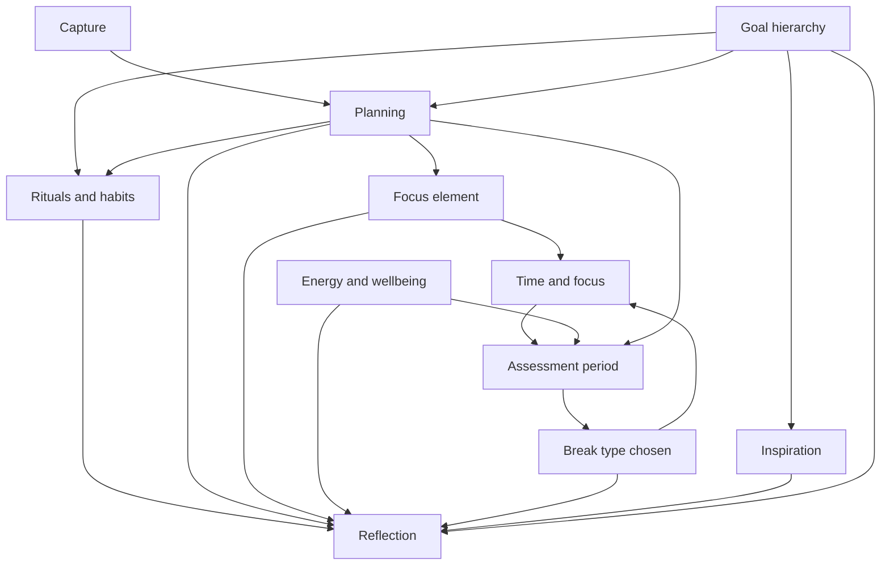

# Domain map

**Purpose:** Break the product into **capability domains** before designing tables. Each domain answers: *what problem does this slice solve?*

**How to use this doc**

1. For each domain, fill **Problem solved** and **In scope (v1 ideas)** — start rough.
2. Add **Out of scope / later** to avoid scope creep.
3. When something stabilizes, **promote one sentence** into [VISION.md](./VISION.md) (product anchor).
4. Note **dependencies** — which domains need another to exist first (e.g. Inspiration needs Goal hierarchy).

Legend: Status is `Draft` until you mark a domain `Reviewed` or `Stable`.

---

## 1. Capture

| Field | Content |
|-------|---------|
| **Status** | Draft |
| **Problem solved** | *Quickly offload thoughts, tasks, and worries so nothing is “spinning” in working memory.* |
| **In scope (v1 ideas)** | Inbox; quick add; minimal friction; optional link “defer to goal” later. During **work periods**, new items may be **queued for assessment** (minimal friction, no full triage) so focus stays protected. |
| **Out of scope / later** | OCR, voice everywhere, email parsing. |
| **Depends on** | — |
| **Feeds** | Planning, Goal hierarchy |

---

## 2. Planning

| Field | Content |
|-------|---------|
| **Status** | Draft |
| **Problem solved** | *Turn capture into **actionable work**: lists, tasks, ordering, deadlines, routines.* |
| **In scope (v1 ideas)** | Task list(s); priorities; due dates; link task → parent goal (level TBD). **Mental focus demand** (per task): classify **how much uninterrupted attention** the task needs to be done **efficiently** — at minimum a **two-level** model: **deep focus** (poor fit when distracted) vs **flexible focus** (tolerates a more scattered mind). Optional finer scale later. Used for **soft day-part guidance**: encourage **deep-focus** tasks **earlier** in the working day and **flexible-focus** tasks **later** (see **Time and focus**). **Short list:** a capped view of **at most three** tasks — **one** is the current **Focus** (see **Focus** domain), **highlighted** in the UI; **up to two** additional tasks for immediate **next** context; can **surface** focus-demand icons or hints when choosing what to promote. Everything else stays in backlog / inbox until promoted onto the short list. **Assessment periods** merge queued interruptions into lists and **re-prioritize**, including **who gets a slot** on the short list. |
| **Out of scope / later** | Full Gantt, resource leveling, shared projects. |
| **Depends on** | Capture (optional), Goal hierarchy (for upward links) |
| **Feeds** | Rituals, Focus, Time and focus, Reflection |

---

## 3. Rituals and habits

| Field | Content |
|-------|---------|
| **Status** | Draft |
| **Problem solved** | *Build **better life habits** by making **repeated sequences** obvious, ordered, and trackable — compatible in spirit with *Atomic Habits* (small stacked behaviors, consistency, identity over time).* |
| **In scope (v1 ideas)** | **Ritual** = named group of **ordered tasks** (e.g. **morning ritual**: get up → brush teeth → take pills → walk dog). **Between-blocks ritual** (template): **(1)** assess / triage **interruptions** from the last work period → lists + reprioritize; **(2)** **exercise snack** — **under 1 minute** movement burst for **mental focus** and **physical health**; **(3)** assess **energy** levels; **(4)** choose **next work block** / next **Focus** and **duration** of the next block (**flexible** — shorter when tired). Steps are **tasks** from **Planning** or ritual-specific steps. **Exercise snack logging:** after (or as part of) the snack step, capture **which exercise** (from a user-defined or preset library) and **how well it went** — e.g. reps, seconds held, perceived effort (RPE), or a simple quality / difficulty rating — so **Reflection** can show **trends and improvement**. Optional: schedule, streaks, link to **goal hierarchy**. UI: run-through checklist, order preserved. |
| **Out of scope / later** | Full habit “score” engines, social accountability, claiming to replace the book or methodology. |
| **Depends on** | Planning (tasks / steps); optional **Goal hierarchy** for meaning / identity |
| **Feeds** | Reflection (ritual completion, **exercise performance** over time), Focus (optional: current step as focus), Time and focus (optional: ritual block vs separate from Pomodoro work) |

**Note:** Rituals complement **Pomodoro-style** **Focus** periods: rituals emphasize **sequence and repetition** for habits; Focus emphasizes **single-task depth** during bounded work. The **between-blocks ritual** is the **default bridge** between work periods (triage → exercise snack → energy → next block). **Exercise snacks** are **not** the three **break** types — they are micro-movement during **assessment**, not deep rest.

---

## 4. Focus (current task) — the Focus element

| Field | Content |
|-------|---------|
| **Status** | Draft |
| **Problem solved** | *Concentrate **without distraction** on a **singular** task — the **Focus element**. The user can **trust the system**: interruptions and new tasks are **not** handled mid-block; they are addressed in **assessment periods** between work periods, so attention stays protected.* |
| **In scope (v1 ideas)** | At most **one** active focus at a time; points to a **task** on the **short list** (from **Planning**). The **short list** shows **≤3** tasks: the focus task **visually highlighted**, plus **0–2** others — **prominent** in the UI (primary surface). Show each task’s **mental focus demand** (from **Planning**) so choices stay conscious. **Gentle encouragement:** when picking or promoting the next focus, **nudge** toward **deep-focus** tasks in **morning / early day** and **flexible-focus** tasks **later** — copy, badges, or sort hints, **not** hard gates. Clear actions: set focus (from short list or promote then focus), clear focus, complete or park, **promote/demote** short-list slots. **During a work period**, UI and flows favor **deep work** on the focus row; captures queue for assessment. |
| **Out of scope / later** | Multiple parallel “focus” slots, team-wide focus, focus shared across devices as a separate product. |
| **Depends on** | Planning (must have tasks or equivalents to attach to). |
| **Feeds** | Time and focus (work periods center on this task), Breaks (pause between periods), Reflection, Energy (optional). |

**Rules:** (1) **At most one** current focus; it must be one of the **≤3** short-list tasks (typically **on** the list already). (2) **Short list capacity:** **maximum three** rows — **one** focus + **at most two** non-focus “next” tasks. (3) **Trust contract:** while in an active **work period**, the product **defers full handling** of interruptions to **assessment** — see **Time and focus**.

---

## 5. Goal hierarchy

| Field | Content |
|-------|---------|
| **Status** | Draft |
| **Problem solved** | *Make **why** visible: daily work ladders up through horizons to **life goals**.* |
| **In scope (v1 ideas)** | Named levels (you choose names); parent/child or graph; “this week’s focus”; life-goal anchor for inspiration. Support **occasional progress look-backs** (what moved this goal forward over a chosen period) — surfaced from **Reflection** and/or **vision board** entry points (see **Inspiration**). |
| **Out of scope / later** | OKR tooling, corporate alignment. |
| **Depends on** | — (foundational) |
| **Feeds** | Planning, Inspiration, Reflection |

**Open decision:** Exact level names (e.g. Life → 3-year → Year → Quarter → Month → Week → Day) — *fill in your preferred ladder.*

---

## 6. Time and focus (work periods, assessment, handoff to breaks)

| Field | Content |
|-------|---------|
| **Status** | Draft |
| **Problem solved** | *Structure the day into **bounded work**, **deliberate assessment**, and **typed breaks** — similar in spirit to the **Pomodoro technique**: work periods are **time-limited** to reduce exhaustion; nothing “falls through the cracks” because assessment handles triage. **Block length adapts** to energy: shorter blocks when tired, longer when fresh.* |
| **In scope (v1 ideas)** | **Work periods:** **flexible duration** — user-chosen length **per block** (presets, last-used, or custom), **not** a single global fixed length required for every session. **As fatigue rises**, the UX should make **shorter** next blocks **easy** (defaults or suggestions informed by **Energy** optional). Tied to the **Focus element** (one task); timer or clear start/end; early end / extend-with-confirm optional. **Optional tracking:** record **planned** duration, **actual** time in focus (if different), and **block count** per day — for **history** and **Reflection** (trends, totals, personal bests). Goal: over weeks, user can **increase** **number of blocks** and/or **typical block size** when capacity allows; data supports **motivation** and **sense of achievement** without mandatory gamification. **Between-blocks assessment:** after a work period, before the **next** — follow **between-blocks ritual** (see **Rituals**): triage interruptions, **exercise snack** (&lt;1 min), energy read, **select next focus** and **next block length** — optionally informed by **mental focus demand** vs **clock / day part** (encourage **deep-focus** work earlier, **flexible-focus** later; user-configurable day windows if needed). **Before a typed break:** when transitioning to rest, use **Energy** to pick **mental / physical / emotional** break type. **Transitions:** work → between-blocks ritual → next work (repeat) or work → assessment → **break** → … Optional calendar export later. |
| **Out of scope / later** | Full calendar replacement, meeting auto-scheduling, employer monitoring. |
| **Depends on** | Planning, Focus; **Energy** informs assessment → break choice |
| **Feeds** | Energy (state check during assessment), Breaks (chosen break type), Reflection |

### Sub-states (conceptual)

1. **Work period** — user on single Focus element; interruptions **queued** for assessment.  
2. **Between-blocks assessment** — **ritual** (recommended default): triage interruptions → **exercise snack** (&lt;1 min) → **energy** check → **choose next work block** / Focus.  
3. **Pre-break assessment** (when applicable) — confirm triage done; **select break type** from exhaustion (see **Breaks**).  
4. **Break** — execute one of **mental rest**, **physical rest / rejuvenation**, **emotional reward** (see **Breaks** domain).

---

## 7. Energy and wellbeing

| Field | Content |
|-------|---------|
| **Status** | Draft |
| **Problem solved** | *Honor **physical, mental, and emotional** capacity — not just hours available.* |
| **In scope (v1 ideas)** | Lightweight check-in (e.g. 1–5 or tags per dimension); optional note; correlate with tasks/breaks/**exercise snacks** / **work block length** over time. **Between-blocks ritual** includes an energy read before choosing the next work block **and** (optionally) **suggested shorter** next block when state is low. **Pre-break assessment** uses **type of exhaustion** to **recommend or set** the next **break** type (distinct from the micro **exercise snack**). |
| **Out of scope / later** | Medical claims, clinical diagnoses, wearable integration (unless you want later). |
| **Depends on** | — (can start parallel) |
| **Feeds** | Time and focus (assessment), Breaks, Reflection |

---

## 8. Breaks

| Field | Content |
|-------|---------|
| **Status** | Draft |
| **Problem solved** | *Recovery matched to **how** you are tired — mental, physical, or emotional — using a **small fixed vocabulary** so choices stay simple.* |
| **In scope (v1 ideas)** | Exactly **three** break archetypes (first-class in product and data): **(1) Mental rest** — cognitive downshift, attention recovery. **(2) Physical rest / rejuvenation** — body, movement, sleep-adjacent, sensory reset. **(3) Emotional reward** — pleasure, meaning, connection, celebration. Break **chosen during pre-break assessment** from **current state** and **dominant exhaustion type**. **Not** the same as **exercise snacks** (&lt;1 min micro-movement during **between-blocks** ritual — see **Rituals** / **Time and focus**). Optional sub-activities under each archetype later (e.g. walk, stretch, music). |
| **Out of scope / later** | Infinite custom break taxonomies on day one; employer surveillance. |
| **Depends on** | Energy and wellbeing (state at assessment), Time and focus (assessment hands off to break) |
| **Feeds** | Reflection |

**Note:** Time-boxed **work periods** (Pomodoro-like) live under **Time and focus**, not here — this domain is **what you do when you are not in focused work**.

---

## 9. Inspiration

| Field | Content |
|-------|---------|
| **Status** | Draft |
| **Problem solved** | *Reconnect with **life goals** through meaningful media — storyboard, images, short prompts — not random quotes.* |
| **In scope (v1 ideas)** | Assets linked to **top-level / life goals**; types: image, storyboard panel, short text — primary surface may be a **vision board** (collage of goal-linked inspiration). **Optional on the vision board (or per goal):** open a **progress look-back** — summary of **movement toward that goal** over a user-chosen window (tasks completed, milestones, focus time tagged to goal, etc. — exact signals TBD with data model). Keeps **forward vision** and **backward progress** in one emotional place. Can **complement** **Reflection** (e.g. celebrate **exercise progress** or streaks with meaningful imagery, not only generic motivation). |
| **Out of scope / later** | Stock photo library, social feed, AI-generated bulk content. |
| **Depends on** | Goal hierarchy (must have stable “life goal” or equivalent) |
| **Feeds** | Reflection |

---

## 10. Reflection

| Field | Content |
|-------|---------|
| **Status** | Draft |
| **Problem solved** | *Close the loop: what worked, energy patterns, break effectiveness, alignment with goals.* |
| **In scope (v1 ideas)** | Daily or weekly prompt; wins; “adjust next week”; optional tie to goal hierarchy; **ritual** completion and streaks (habit feedback). **Periodic goal progress review:** user-triggered or lightly prompted **look-back** on **selected goals** (weekly/monthly/quarterly — user preference), aggregating what the app knows (completed work linked upstream, notes, block time if tagged). Entry from **Reflection** home and **optionally from the vision board** (see **Inspiration**). **Exercise history:** aggregate **exercise snack** (and optional longer exercise) logs — **what** you did and **how well** — into simple **trends** (e.g. weekly volume, personal bests, consistency) so the user **sees improvement** and stays **motivated**. **Work block history** (when tracking enabled): **blocks completed** per day/week, **total focused time**, **average or max block length** — simple charts or summaries so growing **capacity** (more blocks, longer blocks over time) feels **visible** and **rewarding**, not a leaderboard against others. Optional later: whether **deep-focus** tasks tended to land in **early** vs **late** day (pattern visibility, not judgment). |
| **Out of scope / later** | Long-form journaling AI, public sharing. |
| **Depends on** | Most other domains (benefits from tasks, goals, **rituals**, **focus**, energy, breaks) |
| **Feeds** | VISION.md (learned pains), next cycle planning |

---

## Domain dependency sketch

*Typical cycle:* **Work period** (Focus) → **Between-blocks ritual** (triage + **exercise snack** + energy + next block) → next **Work period**; periodically **Pre-break assessment** → **Break** (one of three types) → resume work loop.

---

## Changelog

| Date | Change |
|------|--------|
| *today* | Initial domain map from discovery plan. |
| *today* | Added **Focus** domain: single current task, prominent UI; renumbered following sections. |
| *today* | **Operating rhythm:** trust during work; Pomodoro-like work periods; **assessment** between work and breaks; **three break types** (mental, physical/rejuvenation, emotional reward); exhaustion-informed break choice. |
| *today* | **Rituals and habits** domain (*Atomic Habits*–compatible): named ordered task groups; anchor updated for **better life habits**. |
| *today* | **Exercise snacks** (&lt;1 min) during **between-blocks** assessment; **between-blocks ritual** (triage → snack → energy → next work block); distinguished from **three break types**. |
| *today* | **Exercise logging** (which exercise, how well) and **Reflection** trends for **motivation** / visible improvement. |
| *today* | **Short list:** max **three** tasks; **focus** highlighted; **≤2** others; **prominent** UI. |
| *today* | **Mental focus demand** on tasks (**deep** vs **flexible**); **soft** encouragement: **deep-focus** earlier in day, **flexible-focus** later. |
| *today* | **Flexible work block** length (shorter as you tire); **optional** log of block **durations** / counts; **Reflection** trends for **motivation** and **capacity growth** over time. |
| *today* | **Goal progress look-back** (occasional); **optional** entry from **vision board** / per goal; **Reflection** aggregates. |
