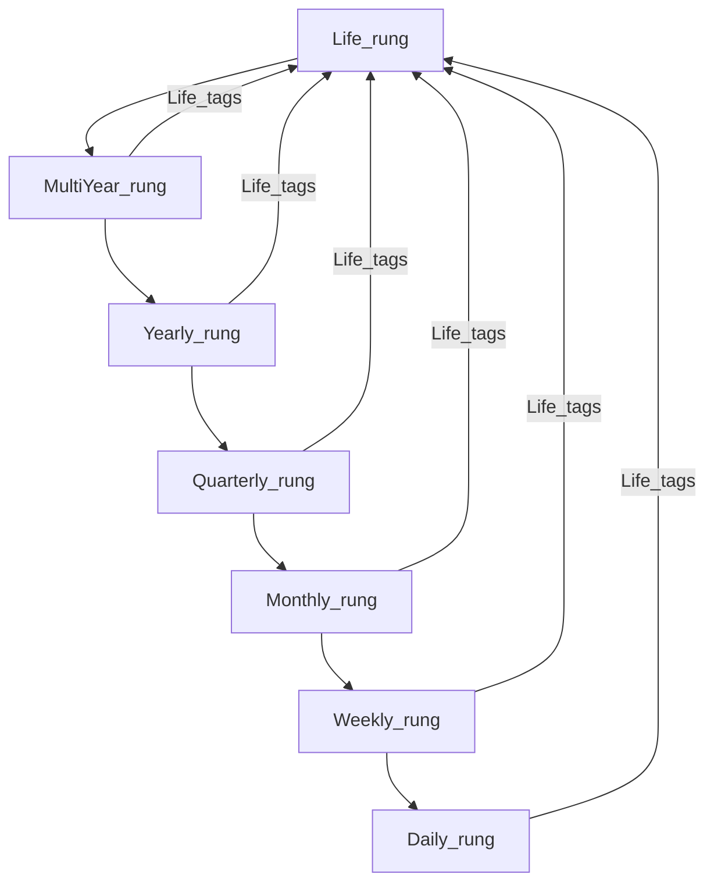

# Domain map

**Purpose:** Break the product into **capability domains** before designing tables. Each domain answers: *what problem does this slice solve?*

**How to use this doc**

1. For each domain, fill **Problem solved** and **In scope (v1 ideas)** — start rough.
2. Add **Out of scope / later** to avoid scope creep.
3. When something stabilizes, **promote one sentence** into [VISION.md](./VISION.md) (product anchor).
4. Note **dependencies** — which domains need another to exist first (e.g. Inspiration needs the **horizon ladder** — §5).

Legend: Status is `Draft` until you mark a domain `Reviewed` or `Stable`.

---

## 1. Capture

| Field | Content |
|-------|---------|
| **Status** | Draft |
| **Problem solved** | *Quickly offload thoughts, tasks, and worries so nothing is “spinning” in working memory — with **almost no structure** until you choose to refine.* |
| **In scope (v1 ideas)** | **Inbox (ultra-simple):** UX close to a **large free-text** surface per item plus **only what the database needs to identify and store the row** (e.g. primary key and minimal technical fields — **not** a rich task model here). **Speed over completeness at entry:** the point is to **document the incoming issue as fast and briefly as possible** so it **interrupts flow minimally**; **full parsing** into tasks / goals / milestones waits for **reassessment** between intervals or a **dedicated inbox-triage work block** (see **Time and focus** and **UI**). **No “when it arrived”** on purpose: we **do not** record ingress timestamps for inbox rows; the point is **content**, not chronology. **Body size is open-ended** — one line (“call mom”) or **pages** describing a whole initiative; storage must tolerate **long text**. **Attachments:** user can **drag and drop** **images** and **files** onto the inbox; they are **appended** to the inbox **record** (e.g. ordered attachment list or embedded references — implementation TBD) so one capture can mix **text + binaries** without leaving the simple surface. **Lifecycle:** during triage, one inbox entry may be **split** into **many** downstream pieces (tasks, subtasks, ritual steps), promoted onto the **horizon ladder** (§5), or seed **Inspiration** / **vision board** material — all **optional** outcomes, not required at capture time. During **normal work periods** on another focus, new items still land this way (minimal chrome, then **back to work**). |
| **Out of scope / later** | OCR, voice everywhere, email parsing, inbox rows as full project-management objects on day one, heavy attachment editing inside the inbox. |
| **Depends on** | — |
| **Feeds** | Planning, horizon ladder (§5), Inspiration |

---

## 2. Planning

| Field | Content |
|-------|---------|
| **Status** | Draft |
| **Problem solved** | *Turn capture into **actionable work**: lists, tasks, ordering, deadlines, routines.* |
| **In scope (v1 ideas)** | **Structured work** lives on the **horizon ladder** (§5): **one list per timescale rung**; each item has a **priority rank** within its rung. **Life tags** (§5): lower-rung items **attach** user-defined **unique** tags that originate on **Life** rung items. **Triage from Capture:** one **inbox** row may be **split** into **many** items across rungs (usually **Daily** tasks) or linked as origin without duplicating the blob. Due dates optional. **Mental focus demand** (per task, typically **Daily**): **deep focus** vs **flexible focus**; used for **soft day-part guidance** (see **Time and focus**). **Short list:** **≤3** tasks — **one** **Focus**, **up to two** others — drawn **primarily from the Daily rung** (see **Focus**). **Daily life maintenance list:** a **separate**, user-editable set of **basic upkeep** items (hygiene, meds, household minima, etc.) that are **not** the same as ladder “project” work — they **repopulate / reset unchecked each calendar day** (or user-defined day boundary). They **do not** consume short-list slots by default; they are **surfaced on the between-blocks / assessment UI** (see **Rituals**, **Time and focus**, **UI**) so life maintenance stays **visible** when transitioning between work periods. Optional: link a maintenance item to **Life tags** or ladder items for reporting. Everything else stays on ladder rungs or in **Capture** until promoted. **Assessment** and **inbox triage** **re-prioritize** within rungs and **who gets a short-list slot**. |
| **Out of scope / later** | Full Gantt, resource leveling, shared projects. |
| **Depends on** | Capture (optional), horizon ladder (§5) |
| **Feeds** | Rituals, Focus, Time and focus, Reflection |

---

## 3. Rituals and habits

| Field | Content |
|-------|---------|
| **Status** | Draft |
| **Problem solved** | *Build **better life habits** by making **repeated sequences** obvious, ordered, and trackable — compatible in spirit with *Atomic Habits* (small stacked behaviors, consistency, identity over time).* |
| **In scope (v1 ideas)** | **Ritual** = named group of **ordered tasks** (e.g. **morning ritual**: get up → brush teeth → take pills → walk dog). **Between-blocks ritual** (template): **(0)** show **daily life maintenance** checklist from **Planning** — same list **every between-blocks transition** that day (items **reset** at the start of each day); user can **check off** or snooze items without leaving the assessment flow; **(1)** ensure **interruptions** from the last work period are **in Capture** (quick queue flush) — **deep parsing** into lists/goals can be deferred to an **inbox triage** work block; **(2)** **exercise snack** — **under 1 minute** movement burst for **mental focus** and **physical health**; **(3)** assess **energy** levels; **(4)** choose **next work block** — **type** (**focus** on short list vs **inbox triage**), **Focus** task if applicable, and **duration** (**flexible** — shorter when tired). Steps are **tasks** from **Planning** or ritual-specific steps. **Exercise snack logging:** after (or as part of) the snack step, capture **which exercise** (from a user-defined or preset library) and **how well it went** — e.g. reps, seconds held, perceived effort (RPE), or a simple quality / difficulty rating — so **Reflection** can show **trends and improvement**. Optional: schedule, streaks, link to **horizon ladder** (§5). UI: run-through checklist, order preserved. |
| **Out of scope / later** | Full habit “score” engines, social accountability, claiming to replace the book or methodology. |
| **Depends on** | Planning (tasks / steps); optional **horizon ladder** (§5) for meaning / identity |
| **Feeds** | Reflection (ritual completion, **exercise performance** over time), Focus (optional: current step as focus), Time and focus (optional: ritual block vs separate from Pomodoro work) |

**Note:** Rituals complement **Pomodoro-style** **Focus** periods: rituals emphasize **sequence and repetition** for habits; Focus emphasizes **single-task depth** during bounded work. The **between-blocks ritual** is the **default bridge** between work periods (**daily maintenance** visible → quick capture flush → exercise snack → energy → choose **next block type** + duration). **Exercise snacks** are **not** the three **break** types — they are micro-movement during **assessment**, not deep rest.

---

## 4. Focus (current task) — the Focus element

| Field | Content |
|-------|---------|
| **Status** | Draft |
| **Problem solved** | *Concentrate **without distraction** on a **singular** task — the **Focus element**. The user can **trust the system**: interruptions and new tasks are **not** handled mid-block; they are addressed in **assessment periods** between work periods, so attention stays protected.* |
| **In scope (v1 ideas)** | At most **one** active focus at a time **during a focus work block**; points to a **task** on the **short list** (from **Planning**, almost always the **Daily** rung of the **horizon ladder** — §5). **Inbox triage** work blocks (see **Time and focus**) **do not** use the short-list row as the primary surface — they use the **triage UI**. The **short list** shows **≤3** tasks: the focus task **visually highlighted**, plus **0–2** others — **prominent** in the UI (primary surface). Show each task’s **mental focus demand** (from **Planning**) and **Life tag** chips (from **Life** vocabulary, §5) so **why** stays visible. **Gentle encouragement:** when picking or promoting the next focus, **nudge** toward **deep-focus** tasks in **morning / early day** and **flexible-focus** tasks **later** — copy, badges, or sort hints, **not** hard gates. Clear actions: set focus (from short list or promote then focus), clear focus, complete or park, **promote/demote** short-list slots. **During a work period**, UI and flows favor **deep work** on the focus row; captures queue for assessment. |
| **Out of scope / later** | Multiple parallel “focus” slots, team-wide focus, focus shared across devices as a separate product. |
| **Depends on** | Planning (must have tasks or equivalents to attach to). |
| **Feeds** | Time and focus (work periods center on this task), Breaks (pause between periods), Reflection, Energy (optional). |

**Rules:** (1) **At most one** current focus; it must be one of the **≤3** short-list tasks (typically **on** the list already). (2) **Short list capacity:** **maximum three** rows — **one** focus + **at most two** non-focus “next” tasks. (3) **Trust contract:** while in an active **work period**, the product **defers full handling** of interruptions to **assessment** — see **Time and focus**.

---

## 5. Goal hierarchy — the horizon ladder

| Field | Content |
|-------|---------|
| **Status** | Draft |
| **Problem solved** | *Make **time scope** and **why** obvious: commitments sit on a **horizon ladder** from **today** through **life**, without fragmenting the UI into parallel lists per theme.* |
| **In scope (v1 ideas)** | **Horizon ladder** = fixed **rungs** (coarse → fine): **Life** (open-ended — “may take forever”) → **Multi-year** → **Yearly** → **Quarterly** → **Monthly** → **Weekly** → **Daily**. **One list / one container per rung** (v1): you always know **which timescale** you are viewing; broader objectives are **not** separate lists at the same tier. Each rung has an **evocative, user-chosen title** for the **current** board (e.g. *“This quarter: ship the MVP skeleton”*) so **scope is obvious**; the app may offer plain defaults (*“This week”*, *“Today”*). **Within each rung:** items are **ranked by priority** (sibling order or explicit rank — implementation TBD). **Life tags (v1):** each item on the **Life** rung carries **user-defined tag(s)** — short labels the user invents (e.g. *#family-health*, *#craft-mastery*). Those tag strings must be **unique across Life items** (one tag identity per life-level commitment in v1; the product **warns or blocks duplicates**). **Lower rungs** (**Daily** through **Multi-year**): any item may **add one or more** of these **Life tags** so execution and mid-horizon work visibly **serves** the right north stars. **Multiple Life tags** on one lower item when it spans several life priorities. **Mid-ladder alignment (optional):** items on **Daily through Quarterly** may still reference **Yearly** / **Multi-year** / **Life** *items* as parent/related links where that helps; **Yearly** may link **Multi-year** / **Life** items; **Multi-year** may link **Life** items — **Life tags** remain the primary **cross-cutting** vocabulary so themes are not siloed by rung. **Daily** holds **executable** work; **short list** and **Focus** usually pull from **Daily**. Support **occasional progress look-backs** on ladder items — from **Reflection** and/or **vision board** (see **Inspiration**). |
| **Out of scope / later** | OKR tooling, corporate alignment; **multiple parallel boards per same rung** on day one (v1 stays **one container per rung**). |
| **Depends on** | — (foundational) |
| **Feeds** | Planning, Inspiration, Reflection |

**Conceptual diagram (temporal spine + tag-up):**

---

## 6. Time and focus (work periods, assessment, handoff to breaks)

| Field | Content |
|-------|---------|
| **Status** | Draft |
| **Problem solved** | *Structure the day into **bounded work**, **deliberate assessment**, and **typed breaks** — similar in spirit to the **Pomodoro technique**: work periods are **time-limited** to reduce exhaustion; nothing “falls through the cracks” because assessment handles triage. **Block length adapts** to energy: shorter blocks when tired, longer when fresh.* |
| **In scope (v1 ideas)** | **Work periods:** **flexible duration** — user-chosen length **per block** (presets, last-used, or custom), **not** a single global fixed length required for every session. **Work block types** (user picks when starting a block): **(1) Focus block** — usual case: one **short-list** task as **Focus** (see **Focus**). **(2) Inbox / capture triage block** — **first-class type:** time-boxed session to **work through the inbox**, **parsing** Capture rows onto the **horizon ladder** (§5) (correct rung, **priority rank**, **Life tag(s)** from the vocabulary defined on **Life** rung items), into **Planning** / **Daily** work, and **Inspiration** / vision board as appropriate; uses a **dedicated triage UI**, not the single-row focus chrome. Same timer / start–end semantics as other blocks so it fits the daily rhythm. **As fatigue rises**, the UX should make **shorter** next blocks **easy** (defaults or suggestions informed by **Energy** optional). **Focus blocks** are tied to the **Focus element** (one task); timer or clear start/end; early end / extend-with-confirm optional. **Optional tracking:** record **planned** duration, **actual** time in focus (if different), and **block count** per day — for **history** and **Reflection** (trends, totals, personal bests). Goal: over weeks, user can **increase** **number of blocks** and/or **typical block size** when capacity allows; data supports **motivation** and **sense of achievement** without mandatory gamification. **Between-blocks assessment:** after a work period, before the **next** — follow **between-blocks ritual** (see **Rituals**): **daily life maintenance** list **present** (see **Planning**), triage interruptions, **exercise snack** (&lt;1 min), energy read, **select next focus** and **next block length** — optionally informed by **mental focus demand** vs **clock / day part** (encourage **deep-focus** work earlier, **flexible-focus** later; user-configurable day windows if needed). **Before a typed break:** when transitioning to rest, use **Energy** to pick **mental / physical / emotional** break type. **Transitions:** work → between-blocks ritual → next work (repeat) or work → assessment → **break** → … Optional calendar export later. |
| **Out of scope / later** | Full calendar replacement, meeting auto-scheduling, employer monitoring. |
| **Depends on** | Planning, Focus; **Energy** informs assessment → break choice |
| **Feeds** | Energy (state check during assessment), Breaks (chosen break type), Reflection |

### Sub-states (conceptual)

1. **Work period (focus)** — user on **single** short-list **Focus** element; new incoming items go to **Capture** with **minimal interruption**; interruptions **queued** for assessment.  
2. **Work period (inbox triage)** — user in **inbox triage** mode: parse Capture into lists, goals, milestones, board assets; still **time-bounded** like a normal block.  
3. **Between-blocks assessment** — **ritual** (recommended default): **daily life maintenance** checklist **on screen** → quick merge of **queued** items into Capture / lists → **exercise snack** (&lt;1 min) → **energy** check → **choose next work block** **type** (focus vs inbox triage) and **duration**.  
4. **Pre-break assessment** (when applicable) — confirm triage done; **select break type** from exhaustion (see **Breaks**).  
5. **Break** — execute one of **mental rest**, **physical rest / rejuvenation**, **emotional reward** (see **Breaks** domain).

---

## 7. Energy and wellbeing

| Field | Content |
|-------|---------|
| **Status** | Draft |
| **Problem solved** | *Honor **physical, mental, and emotional** capacity — not just hours available.* |
| **In scope (v1 ideas)** | Lightweight check-in (e.g. 1–5 or tags per dimension); optional note; correlate with tasks/breaks/**exercise snacks** / **work block length** over time. **Between-blocks ritual** includes an energy read before choosing the next work block **and** (optionally) **suggested shorter** next block when state is low. **Pre-break assessment** uses **type of exhaustion** to **recommend or set** the next **break** type (distinct from the micro **exercise snack**). |
| **Out of scope / later** | Medical claims, clinical diagnoses, wearable integration (unless you want later). |
| **Depends on** | — (can start parallel) |
| **Feeds** | Time and focus (assessment), Breaks, Reflection |

---

## 8. Breaks

| Field | Content |
|-------|---------|
| **Status** | Draft |
| **Problem solved** | *Recovery matched to **how** you are tired — mental, physical, or emotional — using a **small fixed vocabulary** so choices stay simple.* |
| **In scope (v1 ideas)** | Exactly **three** break archetypes (first-class in product and data): **(1) Mental rest** — cognitive downshift, attention recovery. **(2) Physical rest / rejuvenation** — body, movement, sleep-adjacent, sensory reset. **(3) Emotional reward** — pleasure, meaning, connection, celebration. Break **chosen during pre-break assessment** from **current state** and **dominant exhaustion type**. **Not** the same as **exercise snacks** (&lt;1 min micro-movement during **between-blocks** ritual — see **Rituals** / **Time and focus**). Optional sub-activities under each archetype later (e.g. walk, stretch, music). |
| **Out of scope / later** | Infinite custom break taxonomies on day one; employer surveillance. |
| **Depends on** | Energy and wellbeing (state at assessment), Time and focus (assessment hands off to break) |
| **Feeds** | Reflection |

**Note:** Time-boxed **work periods** (Pomodoro-like) live under **Time and focus**, not here — this domain is **what you do when you are not in focused work**.

---

## 9. Inspiration

| Field | Content |
|-------|---------|
| **Status** | Draft |
| **Problem solved** | *Reconnect with **life goals** through meaningful media — storyboard, images, short prompts — not random quotes.* |
| **In scope (v1 ideas)** | Assets linked to **Life** / **long-horizon** ladder items (§5); types: image, storyboard panel, short text — primary surface may be a **vision board** (collage of ladder-linked inspiration). Some assets may **originate** as **Capture** inbox prose that the user later **promotes** or distills into board content. **Optional on the vision board (or per ladder item):** open a **progress look-back** — summary of **movement toward that commitment** over a user-chosen window (tasks completed, milestones, focus time tagged to goal, etc. — exact signals TBD with data model). Keeps **forward vision** and **backward progress** in one emotional place. Can **complement** **Reflection** (e.g. celebrate **exercise progress** or streaks with meaningful imagery, not only generic motivation). **Later:** surface **unlocked achievements** or **milestone** art on the board so motivation stays **personal** and **goal-linked**. |
| **Out of scope / later** | Stock photo library, social feed, AI-generated bulk content. |
| **Depends on** | Horizon ladder (§5) (stable **Life** / long rungs or equivalent) |
| **Feeds** | Reflection |

---

## 10. Reflection

| Field | Content |
|-------|---------|
| **Status** | Draft |
| **Problem solved** | *Close the loop: what worked, energy patterns, break effectiveness, alignment with goals.* |
| **In scope (v1 ideas)** | Daily or weekly prompt; wins; “adjust next week”; optional tie to **horizon ladder** rungs (§5); **ritual** completion and streaks (habit feedback). **Periodic goal progress review:** user-triggered or lightly prompted **look-back** on **selected ladder items** (any rung — user preference), aggregating what the app knows (completed work, **Life tags**, notes, block time if tagged). Entry from **Reflection** home and **optionally from the vision board** (see **Inspiration**). **Exercise history:** aggregate **exercise snack** (and optional longer exercise) logs — **what** you did and **how well** — into simple **trends** (e.g. weekly volume, personal bests, consistency) so the user **sees improvement** and stays **motivated**. **Work block history** (when tracking enabled): **blocks completed** per day/week, **total focused time**, **average or max block length** — simple charts or summaries so growing **capacity** (more blocks, longer blocks over time) feels **visible** and **rewarding**, not a leaderboard against others. Optional later: whether **deep-focus** tasks tended to land in **early** vs **late** day (pattern visibility, not judgment). **Later phase — achievements / gamification:** **badges**, **milestones**, **achievement** definitions (e.g. Fitbit-style), and **optional** celebratory UI when the user hits streaks or completes ladder-linked goals — all **grounded** in **horizon ladder**, **Life tags**, and existing **exercise** / **focus** signals; **opt-in**, **non-punitive**, no competing with strangers. |
| **Out of scope / later** | Long-form journaling AI, public sharing; **toxic** gamification (guilt mechanics, social comparison as default). |
| **Depends on** | Most other domains (benefits from tasks, goals, **rituals**, **focus**, energy, breaks) |
| **Feeds** | VISION.md (learned pains), next cycle planning |

---

## UI (product surface)

Cross-cutting **interface** intent so domains stay aligned when we design screens. Not a separate “data domain” — **behavior and layout** only.

| Topic | Intent |
|-------|--------|
| **Fast capture (minimal flow break)** | Incoming issues are recorded **as quickly and briefly as possible** — default path is **few keystrokes**, **one obvious save**, then **immediate return** to the prior **focus block** (or assessment). **No** forced categorization, deadlines, or parsing at capture time. **Defer structure** to the **next reassessment** or to a scheduled **inbox triage work block**. |
| **Inbox triage block** | When the user starts an **inbox / capture triage** work block (see **Time and focus**), the UI switches to a **triage-optimized** layout: **scan Capture rows** (text + **attachments**), **split** into ladder items / **Daily** tasks, assign **horizon rung**, **priority rank** within that rung, and **Life tag(s)** from the **Life** vocabulary (§5); **promote** to **vision board** when appropriate; archive or merge — all within the **time box** of that block. |
| **Drag-and-drop onto inbox** | **Images** and **files** can be **dragged onto** the inbox capture surface; they are **appended** to the **same inbox record** as the current note (or create a new row if dropped on an empty/new capture — detail TBD). Show **thumbnails / filenames** inline or in a compact list so the record stays **one logical blob** until triage. |
| **Horizon ladder** | **Seven rungs** — **one list per rung** — are a **primary navigation spine**: clear labels for **Life → … → Daily**; each screen shows **which rung** you are on and that rung’s **evocative board title**. On **Life**, each item **defines** its **unique user tag(s)**; on **lower rungs**, **tag chips** apply that **Life tag vocabulary** (picker / autocomplete from Life items; filter by Life tag). **Short list** + **focus** stay **hero** for execution; ladder is **heart** for meaning and scope. |
| **Primary surfaces (recap)** | **Short list** + **focus** remain **hero**; **horizon ladder** navigation is **central**; **inbox capture** is **fast to reach** (keyboard shortcut / slim panel); **Capture** stays minimal. |
| **Motivation and celebrations (later)** | **Achievements** / **badges** / milestone toasts (Fitbit-style **when ready**) should feel **earned** and **tied to ladder + rituals + exercise + focus data** — optional module, not blocking core workflows; user can **tone down** or disable if they prefer quiet tracking only. |
| **Between-blocks surface** | **Daily life maintenance** list is **always part of** this view (with ritual steps): compact checklist, **checked state** resets each day, **not** mixed into the **short list** unless the user chooses. Optional: collapse if empty or if user dismisses for the rest of the day. |

---

## Domain dependency sketch

*Typical cycle:* **Work period** (**Focus** or **inbox triage**) → **Between-blocks ritual** (**daily life maintenance** + queue handling + **exercise snack** + energy + **choose next block type** + duration) → next **Work period**; periodically **Pre-break assessment** → **Break** (one of three types) → resume work loop.

---

## Changelog

| Date | Change |
|------|--------|
| *today* | Initial domain map from discovery plan. |
| *today* | Added **Focus** domain: single current task, prominent UI; renumbered following sections. |
| *today* | **Operating rhythm:** trust during work; Pomodoro-like work periods; **assessment** between work and breaks; **three break types** (mental, physical/rejuvenation, emotional reward); exhaustion-informed break choice. |
| *today* | **Rituals and habits** domain (*Atomic Habits*–compatible): named ordered task groups; anchor updated for **better life habits**. |
| *today* | **Exercise snacks** (&lt;1 min) during **between-blocks** assessment; **between-blocks ritual** (triage → snack → energy → next work block); distinguished from **three break types**. |
| *today* | **Exercise logging** (which exercise, how well) and **Reflection** trends for **motivation** / visible improvement. |
| *today* | **Short list:** max **three** tasks; **focus** highlighted; **≤2** others; **prominent** UI. |
| *today* | **Mental focus demand** on tasks (**deep** vs **flexible**); **soft** encouragement: **deep-focus** earlier in day, **flexible-focus** later. |
| *today* | **Flexible work block** length (shorter as you tire); **optional** log of block **durations** / counts; **Reflection** trends for **motivation** and **capacity growth** over time. |
| *today* | **Goal progress look-back** (occasional); **optional** entry from **vision board** / per goal; **Reflection** aggregates. |
| *today* | **Capture / inbox:** near–**plain text** + keys; **no** ingress timestamp; unbounded body; may **split** into many tasks, **goal**, or **vision board**. |
| *today* | **UI** section: **fast capture**; **inbox triage** as a **work block type**; **drag-drop** files/images onto inbox; sub-states updated. |
| *today* | **Horizon ladder** (§5): **seven rungs**, **one list per rung**, **priority rank**, **tags** from Daily–Quarterly **up** to Year+ / Life; spine of the product; UI + Planning aligned. |
| *today* | **Life tags:** **unique user-defined** tags on **Life** rung items; **lower rungs** **add** those tags to link work to north stars. |
| *today* | **Motivation (later):** **achievements** / **gamification** (Fitbit-style) — opt-in, ladder-linked, non-punitive; **Reflection** + **UI** + **Inspiration**. |
| *today* | **Daily life maintenance** list: repopulates daily; **between-blocks** / assessment UI; separate from **short list**. |
| *today* | **[DEFINITIONS.md](./DEFINITIONS.md):** glossary, naming table, workflow; **DOMAINS** “how to use” + **VISION** related docs updated. |
